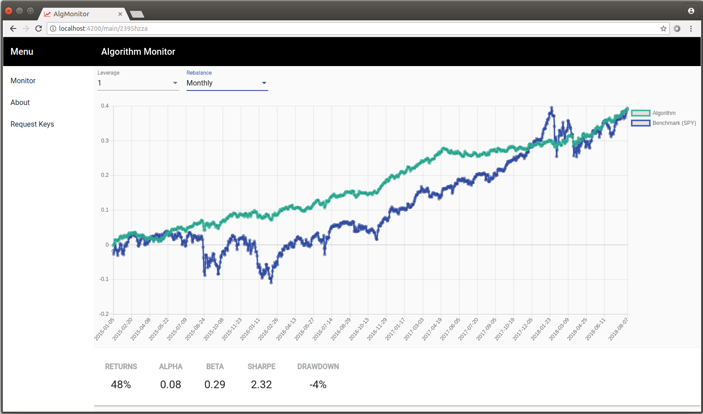
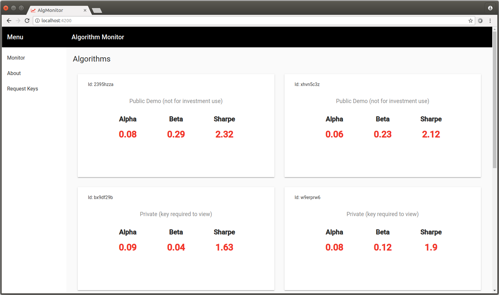
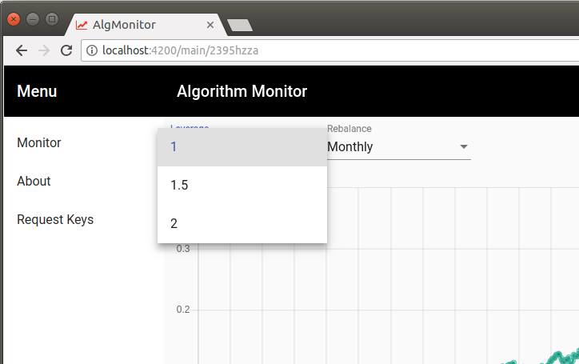

Angular application to monitor investment strategy performance calculated on a remote server. Results can be made available publicly or under a key to protect intellectual privacy. Backend logic related to strategies is never exposed in either case, only results and statistics related to performance over time as displayed.

Two addresses need to be specified under [master/src/app/data.service.ts](https://github.com/VD44/Quantitative-Financial-Strategies-Monitor/blob/master/src/app/data.service.ts). By default they are set to:
```typescript
pollUrl = 'http://localhost:8008/data';
statsUrl = 'http://localhost:8008/stats';
```

First, in order to display a graph and statistics for a specific strategy this application will send a post request to ```pollUrl``` as such:


Second, in order to populate the dashboard that displays the available strategies a get request will be sent to ```statsUrl``` as such:

All calculations take place on a remove server as to protect intelectual privacy. It is recommended that performance time series data is stored in a database using SQL, MongoDB, etc for the purpose of security, stability and effeciency.

In addition, an email can be specified under [master/src/app/data.service.ts](https://github.com/VD44/Quantitative-Financial-Strategies-Monitor/blob/master/src/app/data.service.ts) for others to request keys. By default set to:
```typescript
keysEmail = 'algo.keys@gmail.com';
```
## Screenshots




# AlgMonitor

This project was generated with [Angular CLI](https://github.com/angular/angular-cli) version 6.0.8.

## Development server

Run `ng serve` for a dev server. Navigate to `http://localhost:4200/`. The app will automatically reload if you change any of the source files.

## Code scaffolding

Run `ng generate component component-name` to generate a new component. You can also use `ng generate directive|pipe|service|class|guard|interface|enum|module`.

## Build

Run `ng build` to build the project. The build artifacts will be stored in the `dist/` directory. Use the `--prod` flag for a production build.

## Further help

To get more help on the Angular CLI use `ng help` or go check out the [Angular CLI README](https://github.com/angular/angular-cli/blob/master/README.md).
